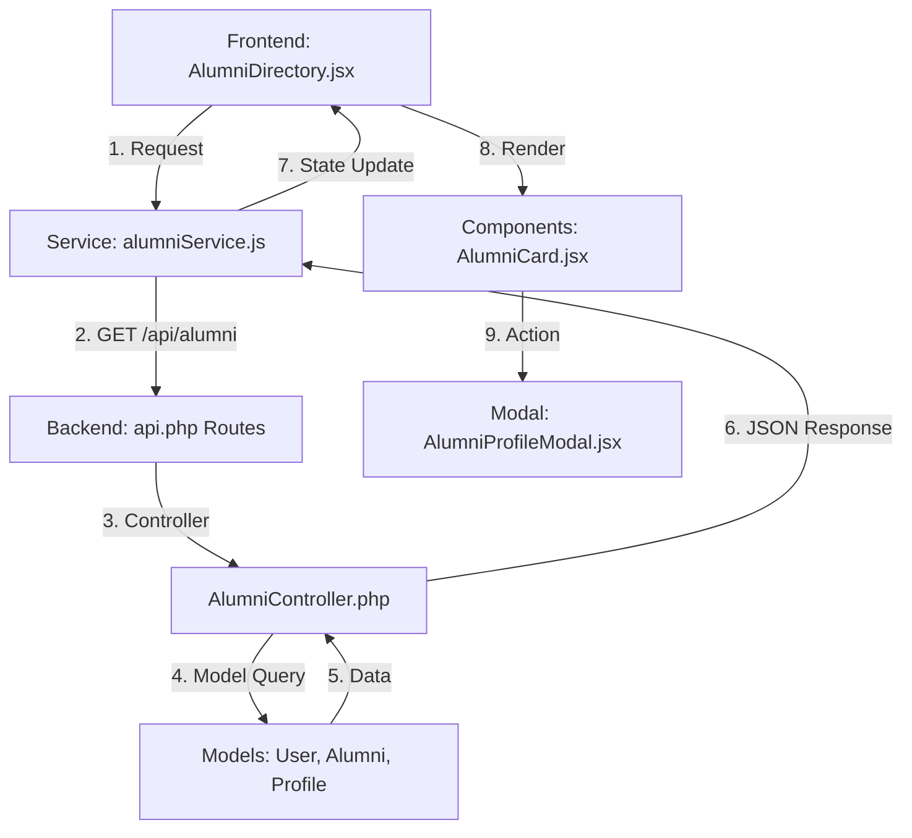

# Alumni Directory Implementation Walkthrough

This document outlines the architectural flow and implementation details of the Alumni Directory feature.

## 1. Goal
Fetch all alumni from the database and display them as cards. Clicking "View Profile" opens a modal popup with detailed information.

## 2. Architectural Flow
The data flow follows the standard MVC pattern integration with a React frontend:

## 3. Implementation Details

### Backend (Laravel)
- **Controller**: `app/Http/Controllers/Api/AlumniController.php`
    - `index()`: Fetches users with the `alumni` role. Uses Eager Loading (`with(['profile', 'alumni'])`) to minimize database queries.
- **Routes**: `routes/api.php`
    - Registered `GET /api/alumni` and `GET /api/alumni/{id}` under the `auth:api` middleware.

### Frontend (React)
- **Service**: `src/services/alumniService.js`
    - Handles the Axios abstraction for fetching alumni data.
- **State Management**: `AlumniDirectory.jsx`
    - Uses `useEffect` to fetch data on mount.
    - Includes **Default Cards** fallback logic: if the database is empty or the API fails, it displays a set of pre-defined alumni to ensure the UI remains functional and looks professional.
- **Components**:
    - `AlumniCard.jsx`: Displays basic info and emits a `onViewProfile` event.
    - `AlumniProfileModal.jsx`: A premium, animated modal built with `framer-motion` to show bio, professional details, and socials.

## 4. Database Schema Interaction
The feature integrates three tables:
1. `users`: Stores core credentials and the `role`.
2. `user_profiles`: Stores personal info (`first_name`, `last_name`, `bio`, `linkedin_url`).
3. `alumni`: Stores professional info (`company`, `job_title`).

---
*Created by Antigravity AI Coding Assistant*
